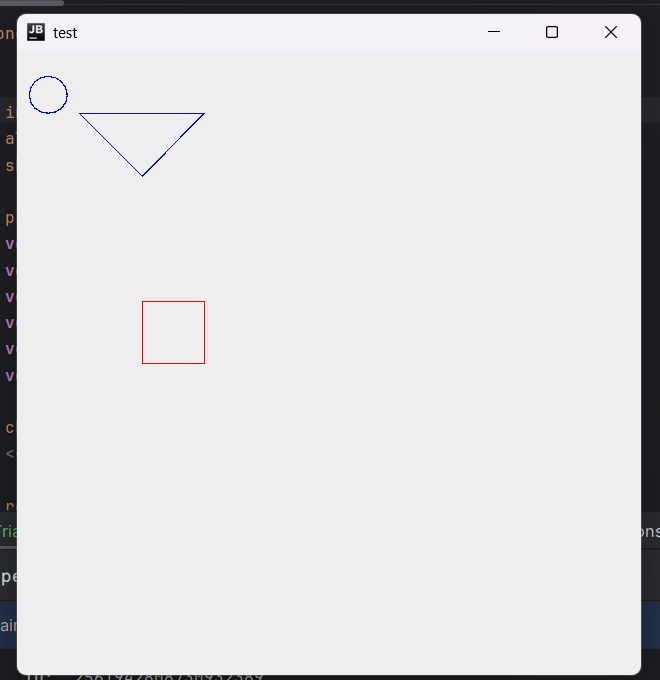

# Editor y Generador de Formas Geométricas con JetBrains MPS

Este proyecto implementa un editor y generador de formas geométricas básicas utilizando JetBrains MPS. Se incluyen formas como círculos, cuadrados y triángulos, que se representan visualmente en un lienzo mediante un programa generado automáticamente.

## Objetivo

El objetivo de este laboratorio es desarrollar un editor de dominio específico (DSL) que permita a los usuarios definir formas geométricas básicas y generar código Java para dibujar dichas formas en una interfaz gráfica (Swing).

## Instrucciones de Ejecución

1. **Requisitos previos**:
   - Instala JetBrains MPS (versión compatible con tu sistema).
   - Java Development Kit (JDK) 8 o superior.

2. **Clona este repositorio**:
   ```bash
   git clone <https://github.com/vgcarlol/Disenio-de-DSL-con-JetBrains-MPS>
   cd <editor-de-formas>
   ```

3. **Carga el proyecto en MPS**:
   - Abre JetBrains MPS.
   - Importa el proyecto desde la carpeta clonada.

4. **Definir formas**:
   - Crea instancias de formas (círculos, cuadrados, triángulos) desde el editor.
   - Configura las propiedades de cada forma, como coordenadas y tamaño.

5. **Genera y ejecuta el código**:
   - Haz clic en el botón **Generate** dentro de MPS.
   - Navega al directorio `sandbox` y ejecuta el archivo `test.java` generado:
     ```bash
     javac test.java
     java test
     ```

---

## Ejemplo de Entrada

En el editor de MPS, define las formas geométricas. Por ejemplo:

```
circle x: 10 y: 20 radius: 30 color: blue
square x: 100 y: 200 size: 50 color: red
triangle v1: (50, 50), v2: (100, 100), v3: (150, 50) color: blue
```

---

## Ejemplo de Salida

Al ejecutar el programa generado, el lienzo mostrará:

- Un círculo azul en (10, 20) con radio 30.
- Un cuadrado rojo en (100, 200) con lado 50.
- Un triángulo azul definido por los vértices (50, 50), (100, 100) y (150, 50).



---

## Funcionamiento del Programa

1. **Editor de Formas**:
   - El editor en MPS permite definir propiedades de las formas (coordenadas, tamaño, color).
   - Los valores se configuran directamente en el editor.

2. **Generación de Código**:
   - A través de plantillas de reducción (`reduce_<Shape>`), el DSL genera código Java para dibujar las formas utilizando `Graphics`.

3. **Renderización en Java**:
   - Las formas se dibujan en un panel Swing (`JPanel`) mediante los métodos `drawOval`, `drawRect` y `drawPolygon`.

---

## Archivos del Proyecto

- **`Triangle.editor`**: Configuración del editor para triángulos.
- **`reduce_Triangle.mps`**: Plantilla de reducción para generar código Java de triángulos.
- **`test.java`**: Archivo generado automáticamente que dibuja las formas geométricas.
- **README.md**: Este archivo, con instrucciones detalladas.

---

## Preguntas Frecuentes (FAQ)

### ¿Cómo cambio el color o las coordenadas de las formas?
Modifica las propiedades directamente en el editor de MPS. Luego, regenera el código y vuelve a ejecutar.

### ¿Por qué no aparece una forma en el lienzo?
Asegúrate de que las coordenadas y dimensiones estén dentro de los límites visibles del lienzo.

---

## Video de Demostración

Puedes ver un video del funcionamiento en el siguiente enlace: [Video de Ejecución](https://youtube.com/tu_video_no_listado)

---

## Autores

Este proyecto fue desarrollado por:
- **Carlos Valladares** - [carlolvgjunior@gmail.com](https://github.com/vgcarlol)